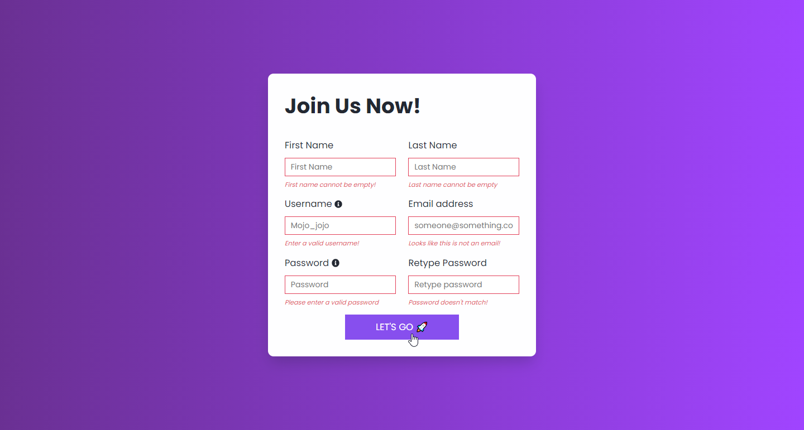
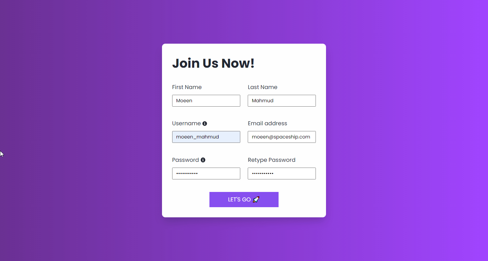

# A sign up form which validates the user information

## Table of contents

- [Overview](#overview)
  - [The challenge](#the-challenge)
  - [Screenshot](#screenshot)
  - [Links](#links)
- [My process](#my-process)
  - [Built with](#built-with)
  - [What I learned](#what-i-learned)
  - [Continued development](#continued-development)
  - [Useful resources](#useful-resources)
- [Author](#author)
- [Acknowledgments](#acknowledgments)

## Overview

### The challenge

I took the challenge to practice the basics of **_RegEX_** and the inner mechanisms for validating a form. A user should input the username, email and password correctly, there would be a tooltip for the user for further help. If the validation success, the border-color of the input field will turn to green. In oppiste, it will turn to red and show the error message.





### Links

- Solution URL: [Git Repo](https://github.com/moeen-mahmud/signup-form-moz)
- Live Site URL: [Live Site](https://signup-form-moz.vercel.app/)

## My Process

### Built With

- HTML5 markup
- Grid
- Flexbox
- Vanilla JS
- RegEx 🔥
- Mobile-first workflow
- [GoogleFonts](https://fonts.google.com/) - For font styles

### What I learned

By doing this project, I learn the basic user validation using vanilla js. I learn some tricky methods and techniques, such as, I implement a very basic **_regex_** format for username, email and password validation. I have also learn a technique for showing tooltip using pure CSS. Below I demonstrate the **_RegEx_** methods for those feature:

- For username -

```js
const isUserName = (userName) => {
  return /^[A-Za-z]\w+[A-Za-z0-9]{4,25}$/.test(userName);
};
```

For email -

```js
const isMail = (userEmail) => {
  return /^(([^<>()[\]\.,;:\s@\"]+(\.[^<>()[\]\.,;:\s@\"]+)*)|(\".+\"))@(([^<>()[\]\.,;:\s@\"]+\.)+[^<>()[\]\.,;:\s@\"]{2,})$/i.test(
    userEmail
  );
};
```

For password -

```js
const isPass = (userPass) => {
  return /^(?=.*?[A-Z])(?=.*?[a-z])(?=.*?[0-9])(?=.*?[#?!@$%^&*-]).{8,}$/.test(
    userPass
  );
};
```

### Continued Development

This challenge helps me a lot to understand the basics of Regular Expression. I build it while I conquer Wes Bos's 30 Javascript challenge. By doing this, I was able to revisit some tricky CSS methods.

### Useful resources

- [Code Grepper](https://www.codegrepper.com/code-examples/whatever/regex+password+validation+javascript)
- [W3Resource](https://www.w3resource.com/javascript/form/password-validation.php)
- [Site Point](https://www.sitepoint.com/learn-regex/)

## Author

- Twitter - [moeen_mahmud](https://twitter.com/moeen_mahmud)

## Acknowledgments

I'd like to thank [Sumit Dadda](https://www.youtube.com/c/LearnwithSumit) for his amazing tutorial on **Regular Expression**. It helps me a lot to understand the very basics.
